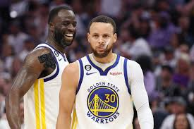
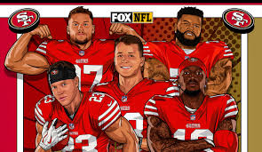

 Jacob's pro coding page 

 
 

    
    

 Proud 49ers and Warriors fan
 
 

 The two best foods

    
    

 If you somehow don't like these foods that is a problem. They are simply just the best and most accesable foods. Tacos you can find anywhere in different viraties. Chicken alfredo no matter where you get it from it has a consistant taste and is always a good option.

    <button style="
        display: inline-block;
        padding: 10px 20px;
        font-size: 16px;
        font-weight: bold;
        text-decoration: none;
        color: white;
        background-color: #007bff;
        border: none;
        border-radius: 5px;
        cursor: pointer;
        transition: background-color 0.3s, transform 0.2s;
    ">I don't do anything!</button>

    <a href="https://google.com" style="
        display: inline-block;
        padding: 10px 20px;
        font-size: 16px;
        font-weight: bold;
        text-decoration: none;
        color: white;
        background-color: #007bff;
        border: none;
        border-radius: 5px;
        cursor: pointer;
        transition: background-color 0.3s, transform 0.2s;
    ">Google</a>
    <a href="https://www.youtube.com/watch?v=0a5hUOTn8xA&t=36s" style="
        display: inline-block;
        padding: 10px 20px;
        font-size: 16px;
        font-weight: bold;
        text-decoration: none;
        color: white;
        background-color: #FFD700;
        border: none;
        border-radius: 5px;
        cursor: pointer;
        transition: background-color 0.3s, transform 0.2s;
    ">Goat</a>

 
 
 
<html lang="en">
<head>
    <meta charset="UTF-8">
    <meta name="viewport" content="width=device-width, initial-scale=1.0">
    <title>DON'T PRESS ME</title>
    
</head>
<body>
    <h1>U Should Press Me</h1>
    <button id="soundButton">Play Sound</button>
    <audio id="sound" src="Stupid.mp3" preload="auto"></audio>

    
</body>
</html>
